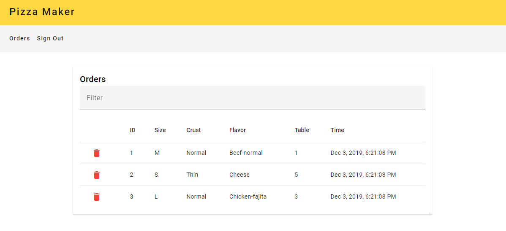

# Example Pizza Maker Application
A VSCode Docker configuration is used to set up the Angular environment.

## Login Screen
* Creates an authorization request using the [API](https://pizza-api-app.herokuapp.com/api/ui/#!/Orders/orders_delete)
* Stores authorization token in local storage
  * Token can be accessed through authorization service
  * Token is required to access home and order screens (AuthGuard will block access)
  * Token is used in the interceptor to provide authorization headers
* Notification is shown to user if error occurs

---

## Pizza Order Creator
* An order service provides the options in the creator
  * This is so it could easily be replaced in the service without changing implementation
  * Types for each option are located in src/app/enums
* Order details are provided by accessing the FormGroup value
* Notification is shown to user if error occurs and when order is submitted

---

## Orders
* The filter searches each table cell for a matching value
* Timestamps are formatted with date pipe
* Notification is shown to user if error occurs and when delete is successful
